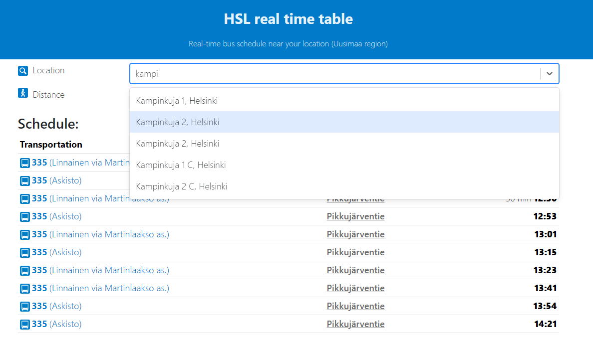
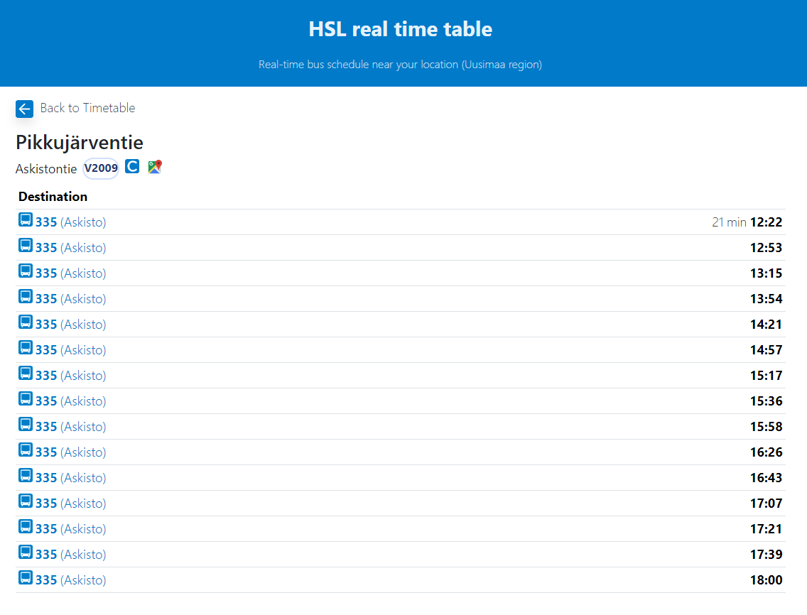

This project is inspired by my own convenience. Currently, HSL(Helsinki Regional Transport) app offers transportation timetables only if the user selects a certain route or selects stops as their "favorite" stops from their account. However, there is currently no website/application which displays all the available transportation schedules nearby the current user's location or selected street address within the Uusimaa region (Helsinki/Espoo/Vantaa). Using this application (HSL home info), users can conveniently look up the real-time transportation schedules nearby their home/work/or wherever.

Currently, map integration and searching by stop view is missing but will be constantly improved and added in the future.

The project is using HSL's Routing API ([digitransit Routing API](https://digitransit.fi/en/developers/apis/1-routing-api/)) to get the latest transportation schedule and the stop information and front-end is own-made using React.js. The project is deployed and is available at [here](https://d2v9b00naokpu1.cloudfront.net/schedule).

# Getting Started with Vite

This project was bootstrapped with [Create React App](https://github.com/facebook/create-react-app).

## Available Scripts

The project is deployed at AWS cloudfront. However, if you want to run the project locally, in project directory, you can run:

### `npm run install`
you can run the command npm run install to install the required packages.

### `npm run start`

Runs the app in the development mode.\
Open [http://localhost:5173](http://localhost:5173) to view it in the browser.

The page will reload if you make edits.\
You will also see any lint errors in the console.

### `npm run preview`
`vite preview` command will boot up a local static web server that serves the files from `dist` at [http://localhost:4173]. Using this, you can easily check if the production build looks okay in local environment.

# Project overview
Once you directed to the deployed [HSL web application](https://d2v9b00naokpu1.cloudfront.net/schedule), you will see the front-view that asks you to select the location and the distance from the selected location. If you want to set the location as current location, you would need to consent giving the current location to our app. The default distance from the location is set to 500 meters.
\
If you want to see the location other than the current location, you can simply type the **Street name** in Uusimaa region (Helsinki, Vantaa and Espoo) and the result will automatically suggest the street name based on your search.
*Image1: Front view of the HSL app*

In addition to the schedule, you can view the timetable of certain stop as well. By clicking the stop name at front view (Image 1), you can navigate to the timetable of certain stop. 
*Image 2: stop view*
